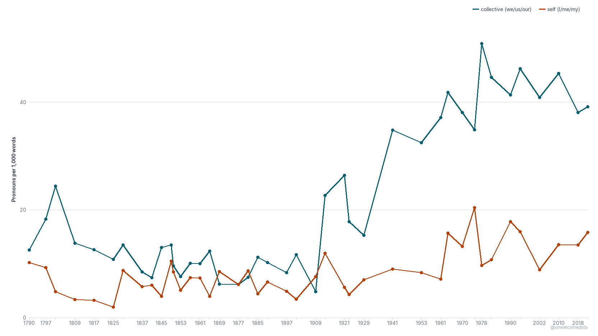
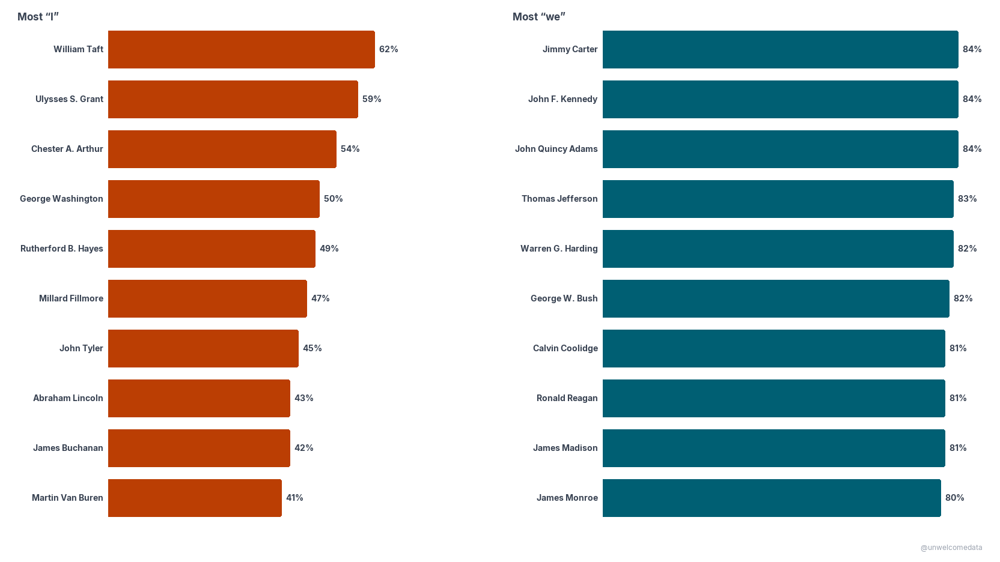
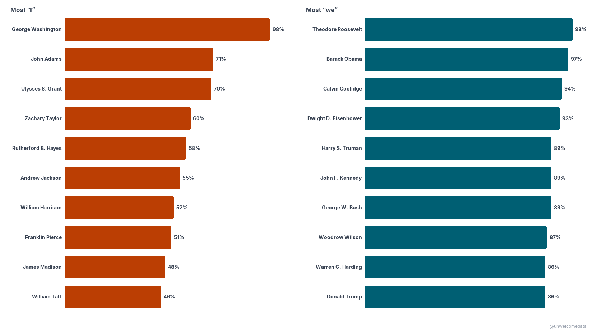
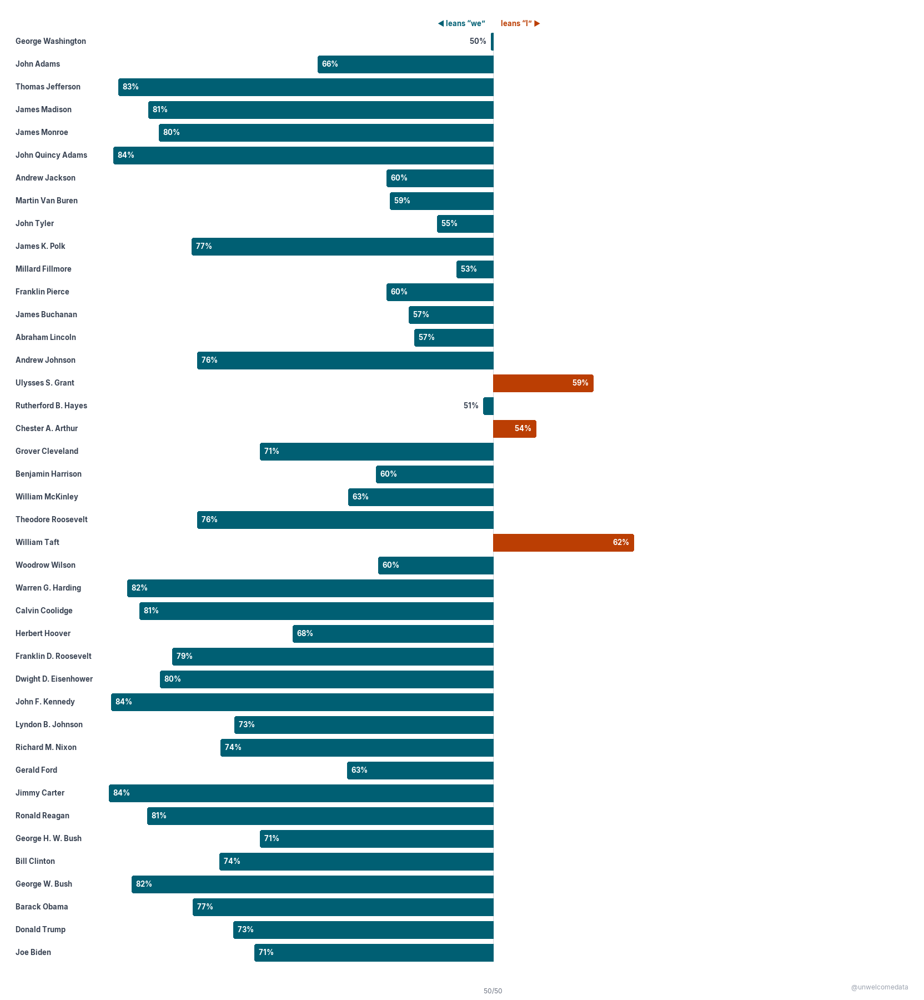
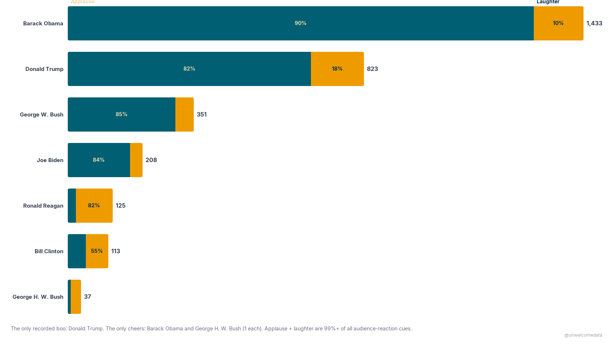
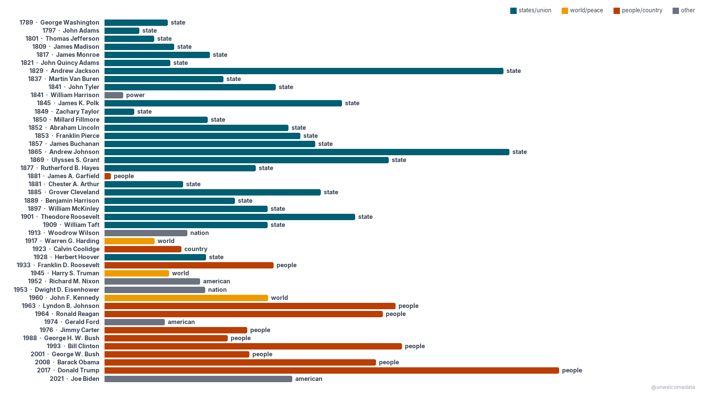

# Presidential speeches — how presidents talk

**[@unwelcomedata](https://github.com/unwelcomedata)** · data from public sources

A quantitative look at **1,059 U.S. presidential speeches** from 45 presidents
(1789→present), drawn from the University of Virginia Miller Center archive. The
lead question: do presidents frame things around **self** (*I / me / my*) or the
**collective** (*we / us / our*) — and how has that changed over 230 years?

**The short answer:** the shift over time isn't rising self-focus — it's the
**rise of "we."** In the State of the Union, collective language climbs steeply
across the broadcast era while self-reference stays comparatively flat. The most
"I"-leaning State of the Union presidents are 19th-century (Taft, Grant, Arthur);
the most "we"-leaning are modern (Carter, Kennedy).

---

## The charts

Each chart is rendered for the web (click any chart to open it full-size). Figures
are averages **within one speech type** — State of the Union or Inaugural — because
the self/collective mix depends heavily on the setting, and because the corpus mixes
eras (see *How it was measured*).

### State of the Union — self vs collective, by president
Each dot is one president's average across their State of the Union addresses (per
1,000 words), placed at their first SOTU year: collective *we/us/our* vs self
*I/me/my*.

### The "I" presidents and the "we" presidents (State of the Union)
Left: presidents whose SOTU first-person pronouns are most often **"I"** (share that
are "I"). Right: most often **"we"** (share that are "we"). Top 10 each, ≥2 SOTUs.

### The "I" presidents and the "we" presidents (Inaugural addresses)
The same cut for **inaugural addresses** — left = most "I" (share that are "I"),
right = most "we" (share that are "we").

### Every president's lean toward "I" or "we", chronologically (State of the Union)
All SOTU presidents (≥2 SOTUs) in time order, diverging from a 50/50 split: right
leans **"I"**, left leans **"we"**. The percentage on each bar is the leaning side's
share.

### Applause and laughter
Transcriber markers of live audience reaction per president (presidents with ≥20
markers): applause vs laughter. Almost entirely a broadcast-era phenomenon.

### Every president's most-used word, 1789→present
Each president's single most-frequent word, in chronological order, colored by
word-family. **"State"** dominates 1789–1909, giving way to **"world"** in the
mid-century superpower era and **"people"** from the New Deal onward.

Additional charts (State of the Union average length by president; speeches-per-year
corpus coverage) are available in the repo (`docs/`).

---

## Word clouds — every president, three ways

**[▶ Open the interactive word-cloud picker](docs/presidents.html)**

Pick any of the 45 presidents and switch between three views:

- **Distinctive** — words a president used far more than *other* presidents (TF-IDF);
  their defining vocabulary.
- **Most-used** — their own most-frequent words (common function words removed).
- **Phrases** — distinctive two-word phrases (so "united states" stays one thing).

Clouds show only words the president actually **spoke** — transcription cues like
`[Applause]`/`[Laughter]`, and speaker-label scaffolding like "president" from
`Q: Mr. President` attributions, are excluded (see *How it was measured*).

---

## How it was measured

- **Metric — self vs collective.** For each speech, first-person pronouns are counted:
  *self* = I, me, my, mine, myself (+ contractions); *collective* = we, us, our, ours,
  ourselves (+ let's). `self_share` = self ÷ (self + collective); 0.5 is balanced.
  Rates are per 1,000 words so speeches of different lengths compare fairly.
- **Compared within one speech type.** The corpus is curated and its coverage is
  uneven, so per-president comparisons are made *within* the State of the Union series
  or *within* inaugural addresses — never pooled across settings.
- **A real series break.** State of the Union messages were **written and read by a
  clerk from 1801–1912**, then **spoken** from 1913 on. Length and style change sharply
  at that break; charts note it, and length comparisons are read with it in mind.
- **Words are counted transparently** — a simple lowercase tokenizer (HTML entities
  decoded, tags stripped), an explicit stopword list, regular plurals folded to their
  singular (slave+slaves = one word), and transcription scaffolding excluded. No hidden
  NLP model; every count is explainable. Full detail in [SOURCES.md](SOURCES.md).
- **Frequency measures use, not stance.** This counts what a president talked about,
  not their position — "no new taxes" still counts "taxes." Negation and sentiment are
  out of scope for a transparent frequency method.
- **Measured as delivered.** Many speeches were ghostwritten; this analyzes the text
  as delivered, not authorship.

---

## The data

- **[Download the dataset (CSV)](export/presidential_speeches_v1.csv)** — one row per
  speech, with pronoun counts, rates, `self_share`, speech type, and the written/spoken
  era flag.
- **[Codebook](export/presidential_speeches_v1_codebook.md)** — plain-English
  description of every column.

## Reproduce it

The pipeline is committed in this repo. `src/` holds the ingest, cleaning, and
feature/word-processing logic (`src/prepare.py` carries the transparent tokenizer,
plural-folding, and scaffolding exclusions); `notebooks/` (on the `main` branch)
narrate each stage from raw archive to the published charts. `config.yaml` documents
the source and settings.

---

## Sources & license

Primary source: the **University of Virginia Miller Center** curated presidential
speech archive (public domain). Full attribution, collection method, definitions, the
written/spoken series break, and known limitations are in [SOURCES.md](SOURCES.md).

---

> **AI-Assisted Development**
> This project was built with the assistance of [Kiro](https://kiro.dev), an
> AI-powered development environment. All data sourcing decisions, methodology
> choices, and published findings are the responsibility of the author. AI was used
> for code generation, data pipeline construction, and research assistance — not for
> analysis conclusions or editorial judgment.
